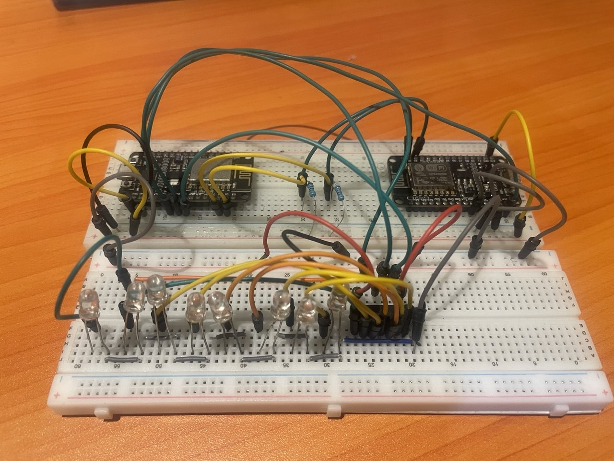
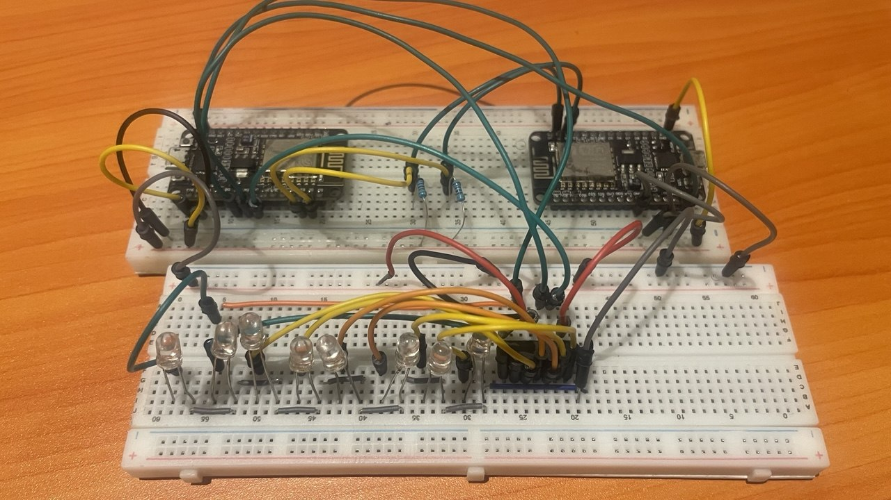
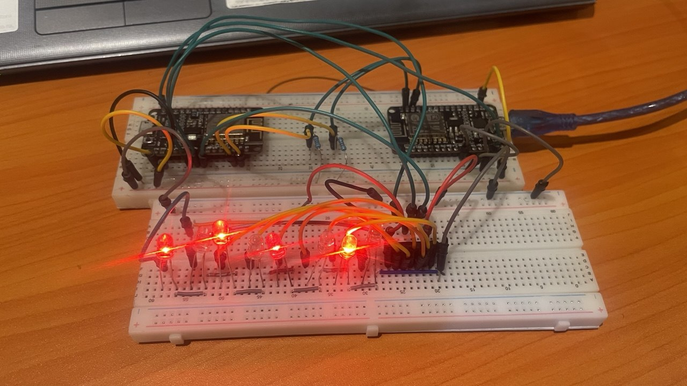
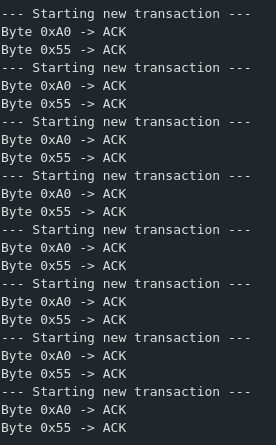
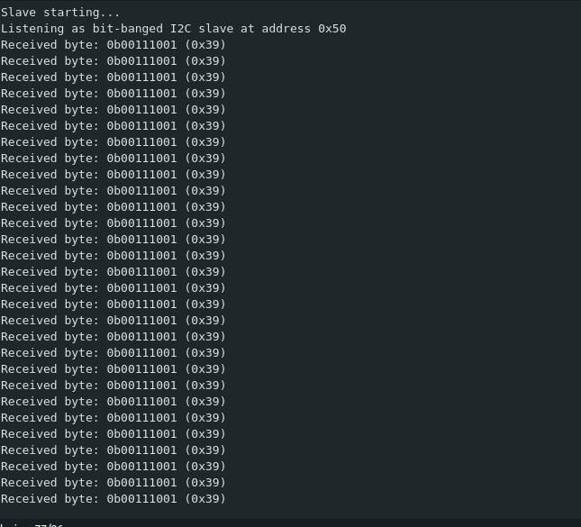

# I2C by Bit-Banging on ESP8266(NodeMCU)

I wrote both ends of an I2C link from scratch, in software, on two ESP8266
boards. The controller sends a byte, and the target shows it on 8 LEDs.



## Why
Over the last few months I've been building projects to learn hardware
concepts. This project is one of three:
1. [SPI / I2C with bit-banged timing (this project)](https://github.com/korkordesmond/i2c-bitbang-esp8266)
2. RISC CPU Core
3. [State-Machine Traffic Light Controller](https://github.com/korkordesmond/Sync-Traffic-Light-Controller)

## What is I2C
I2C is a serial communication protocol that uses only two signal lines:
Serial Data (SDA) carries the data, and Serial Clock (SCL) carries the clock.

Each frame is 8 bits followed by one ACK/NACK bit, so 9 clock pulses per frame.
The receiver signals ACK by pulling SDA low during the 9th clock; if SDA stays
high, that is a NACK.

A transaction begins with an address frame: the first 7 bits are the target
address, followed by a single bit for the mode (READ = 1, WRITE = 0). Data
frames that follow use all 8 bits for data.

- **START condition** (begins a transaction): SDA goes LOW while SCL is HIGH.
- **STOP condition** (ends a transaction): SDA goes HIGH while SCL is HIGH.
- Outside of START/STOP, SDA should only change while SCL is LOW.
- Both lines are **open-drain**: devices only pull a line low or release it,
  and the pull-up resistors bring it high. When the bus is idle, both SDA and
  SCL are HIGH.

## Brief
I started with the `Wire` library to make sure my connections were good. After
verifying the wiring, I wrote my own logic from scratch for both boards.

- **The controller** is a state machine (IDLE, START, SEND_BYTE, READ_ACK, STOP).
  It advances one step every `TICK_US` microseconds (currently `TICK_US = 4`),
  so it never sits blocked in a delay. Every second it sends the address frame
  for `0x50` with the write bit (the byte on the wire is `0xA0`), then the data
  byte `0b00111001`. Once the bus is idle again, it prints whether the address
  byte and the data byte were each ACKed. It supports clock stretching: if the
  target holds SCL low, the controller waits up to 10 ms before aborting.
- **The target** uses two GPIO interrupts. One watches SDA to catch START and
  STOP; the other watches SCL to read each bit and send the ACK. When a
  transaction ends, it shifts the byte into a 74HC595, which lights the LEDs.
  It never stretches the clock.
- **Open-drain:** neither side ever drives a line high. Each one either pulls
  the line low or lets go, and the pull-up resistors do the rest.

### Clock speed
One data bit takes 4 ticks, so the nominal bus clock is
`1,000,000 / (4 × TICK_US)` Hz. At `TICK_US = 4` that is about 62.5 kHz. The
real clock is lower, because most ticks change a pin with
`pinMode`/`digitalWrite` and the main loop only checks the time when it comes
around to it. At `TICK_US = 1` the nominal 250 kHz is above the 100 kHz of
standard-mode I2C, so the real bus speed there is out of spec territory
either way.

## Components
- 2 × ESP8266 NodeMCU (controller and target)
- 1 × 74HC595 shift register
- 8 × LEDs + 8 × 220 Ω resistors
- 2 × 5.1 kΩ pull-ups (SDA and SCL to 3.3 V, one pair for the whole bus)
- Breadboards and jumper wires

Both sketches also enable the ESP8266's internal pull-ups (`INPUT_PULLUP`),
which act in parallel with the external resistors.

## Wiring

```
  CONTROLLER (ESP8266)                           TARGET (ESP8266, address 0x50)
 +---------------------+     SDA (D2)  <---->   +-------------------------+
 |  bit-bang controller|     SCL (D1)  ----->   |  bit-bang target (ISRs) |
 |  sends 0b00111001   |     GND       -----    |                         |
 +---------------------+                        |  D7 -> SER   (pin 14)   |
                                                |  D5 -> SRCLK (pin 11)   |
   5.1k pull-ups: SDA and SCL to 3.3 V          |  D6 -> RCLK  (pin 12)   |
                                                +------------+------------+
                                                             |
                                                             v
                                                +-------------------------+
                                                |  74HC595 shift register |
                                                |  VCC, SRCLR -> 3.3 V    |
                                                |  GND, OE    -> GND      |
                                                +------------+------------+
                                                             | Q0..Q7
                                                             v
                                                8 x (220 ohm -> LED -> GND)
```

I connected the Vin pins of both boards so that powering one powers both.
Also the GND and 3V3 pins of both boards are tied.
**Power the pair from a single USB source only.** Plugging both boards into USB
while their Vin pins are joined can back-feed one port from the other.

```
 3.3 V ----+-----------+
           |           |
         5.1k        5.1k
           |           |
 SDA ------+-----------|----- Controller D2 ----- Target D2
                       |
 SCL ------------------+----- Controller D1 ----- Target D1

 GND ------------------------------------------- common to both boards
```

On the 74HC595, I tied VCC (16) and SRCLR (10) to 3V3, and GND (8) and OE (13)
to GND. Q0 to Q7 each go through a 220 Ω resistor to an LED to GND.




## How to run it
```
.
├── controller/controller.ino
├── target/target.ino
├── images/
└── README.md
```

Flash `./target/target.ino` to the target and `./controller/controller.ino` to
the controller, then open the controller's serial monitor at 115200 baud. When
it works, both the address byte and the data byte show `ACK`, and the LEDs show
the bit pattern of the data byte. The target's serial monitor prints the
received byte.




## Issues
- **Getting an ACK took the longest.** I first tested the connections with the
  `Wire` library on the target. With it, the controller's serial monitor
  showed NACK instead of ACK, and the target printed nothing. I couldn't tell
  whether any data was being corrupted, because I had no oscilloscope or logic
  analyzer to inspect the signals. I spent almost two weeks bit-banging the
  target myself. Only then did I realise the NACKs happened only with the
  `Wire`-based target: my bit-banged target ACKed every time.
- **The `Wire` target NACKed at slow clocks.** For example, at
  `TICK_US = 200` (about 1.25 kHz) the `Wire` target NACKed, while my
  bit-banged target ACKs at the same speed. I don't know why the two differ.
  | Setting | Nominal clock | Result |
  |---|---|---|
  | `TICK_US = 1` (fastest tried) | 250 kHz | ACK |
  | `TICK_US = 4` (current) | 62.5 kHz | ACK |
  | `TICK_US = 25` | 10 kHz | ACK |
  | `TICK_US = 200` | 1.25 kHz | ACK |

## What I learned
- Bit-banging is possible, but it is much slower than dedicated I2C hardware.
- Having the right instruments matters. I spent almost two weeks on the ACK
  failure because I had no oscilloscope or logic analyzer to inspect the
  timing.
- A library target can behave differently from a hand-written one at slow
  clocks, so it is worth testing against more than one target.

## Limitations
- I wanted to measure setup and hold times, but without a logic analyzer or an
  oscilloscope I couldn't.
- The clock speeds above are nominal, calculated from `TICK_US`. The real SCL
  frequency is lower because of the per-tick overhead and was never measured.

## What I'd do next
- Make the controller able to read data from the target.
- Find the upper clock limit and measure the real SCL frequency.
- Get a logic analyzer and compare the real waveforms against the I2C spec.
